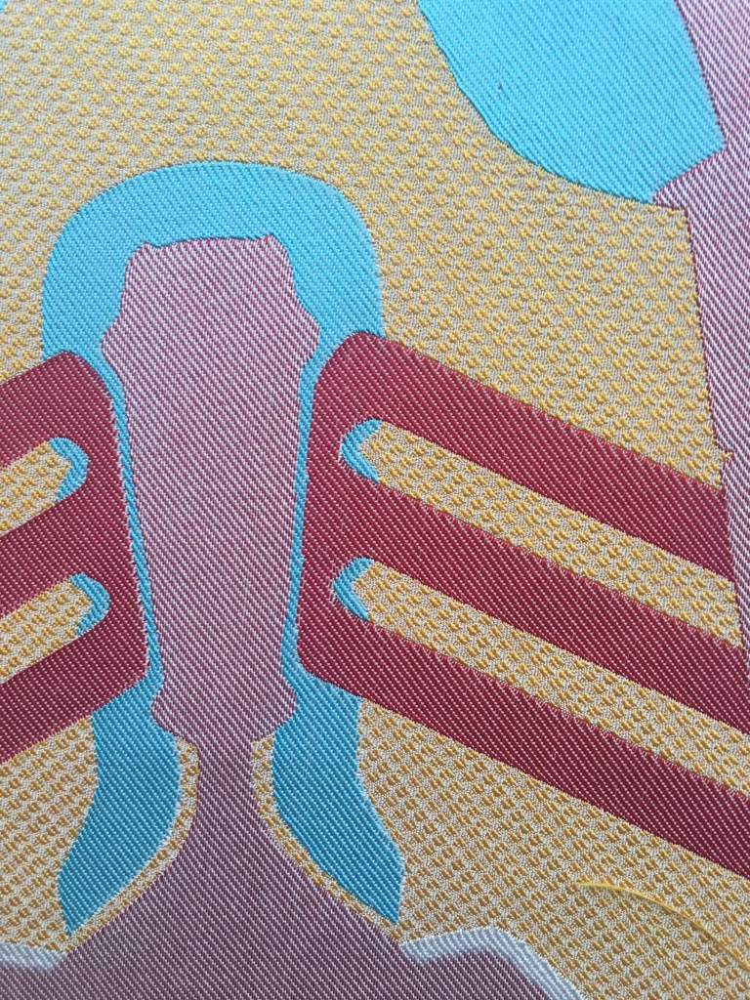
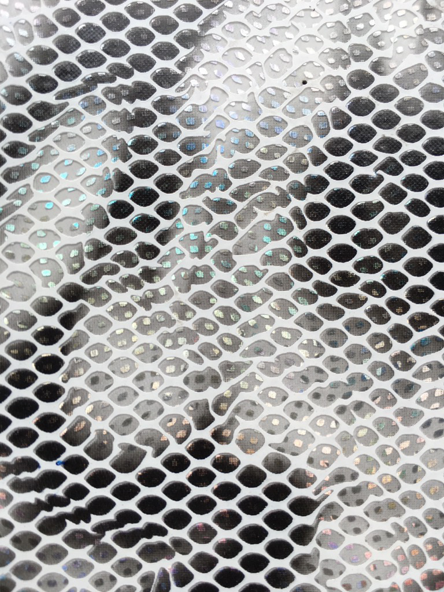
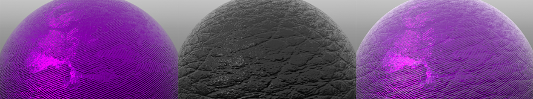
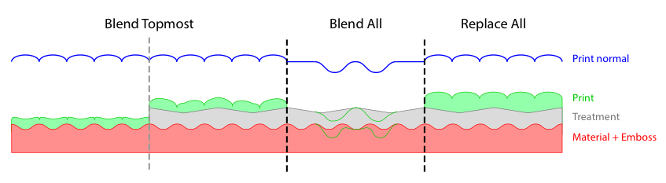

# Advanced Material Data Format

*Version: 2.1*

## Content

1. [Description](#description)
1. [Use Case](#use-case)
1. [Material Types](#material-types)
1. [Color Spaces](#color-spaces)
1. [Texture Color Interpretation](#texture-color-interpretation)
1. [Parameter Functions](#parameter-functions)
1. [License](#license)
1. [Terms and conditions](#terms-and-conditions)
1. [References](#references)

## Description

The Advanced Material Data Format (short AMDF) is a unified description
of complex materials. Within this format, all parameters that are needed
for a proper shading of virtual materials are stored in an XML file.

Its basis is the physically based shading model that was introduced in
2012 by Brent Burley for the Walt Disney Animation Studios[<sup>1</sup>](#references). This is
a "principled" model that was developed to be easy to use rather than
physically correct. In 2015[<sup>2</sup>](#references), an updated version of this Disney BRDF
was published, which has some improvements regarding subsurface
scattering and Fresnel, as well as additions like transmissions and a
thin-surface approximation. We are adopting some of those changes in our
material shading model.

To define the structure of the AMDF we use an XML Schema Definition
file. The exact structure can be seen in the corresponding XML schema
documentation. The base of an AMDF is one of five material types which
will be described in the following.

## Use Case

This XML schema is used to define the visual appearence of virtual materials.
It is independent from a specific 3D rendering software. The only restriction is,
that the application has to implement the Disney BRDF standard as described above,
to get comparable results. 

adidas is not responsible for the usage of this schema for different purposes
than the one described in this section.

## Material Types

Our material data format can cover different kinds of material types.
Each of them has a set of meta-data attributes to hold additional data
like an ID or the creation data.

This chapter lists all those types and describes how those different
materials must be handled and which parameters are used.

### Material (M)

A *Material* describes a set of physical materials packed together into
one file as sub-materials. This clustering is done to associate multiple
sub-parts of a material with different structure (like a fabric with
multiple knit structures) with the same ID. An example can be seen in
Figure 1.

In later processes, multiple sub-materials can be placed on one part of
a geometry. By applying alpha/mask maps to those sub-materials, they are
masked out against each other. Because these alpha/mask maps are
depending on a specific 3D model and thus part of the geometry, they
aren't stored in the AMDF, as this is only a material description
format.

A sub-material stores the front facing side of the material and can as
well hold the side and back faces if needed. Each of those faces can
then consist out of one or multiple layers. The material layers contain
the actual shading parameters, together with some additional values,
e.g. for the possibility of recoloring it (see [HSV Shift](#hsv-shift)).

  |  
 --|--
 Figure 1: Multi-sub-material with different knit structures | Figure 2: Multi-layered material.

The layers of a multi-layered sub-material are blended against each
other using alpha maps. Here, the alpha map is part of the actual
material layer (other than for sub-materials) as it defines, where holes
are (e.g. in a knitting structure). For ordering these layers, the
mandatory *order* attribute is used. The topmost layer has the lowest
value and it's increasing as you peel the layers to the bottommost.

### Emboss (E)

An *Emboss* represents a surface structure, which can be applied to a
part of geometry, for example a leather structure on a plastic material.
Embosses can have both a *normal* and *displacement* map. Which one of
those is used is selected when applying the emboss to a material in the
render software.

A normal map of an Emboss must be blended together with the normal maps
of the sub-material that it is applied to using the calculation shown in
5.2. When using a displacement map, then its values are simply added to
the values of the displacement maps of the sub-material.

The *roughness* and *specular* values of the Emboss will override the
corresponding values of the sub-material. If no *roughness* and/or
*specular* value is provided, then the values of the sub-material are
used.

### Color

*Color* describes a single color, which is later used to recolor a
single material layer. This recoloring is done as shown in [HSV Shift](#hsv-shift) by using
the *baseColor* and *originalColor* of the material layer, that the
color is applied to, and the *colorValue* of the Color.

#### Color Types

The AMDF is capable of handling different kinds of colors. The different
types are described hereafter.

##### Normal Color (NC)

*Normal Colors* are the simplest type of color as they are only
replacing the color of the underlying material using the algorithm
described in [HSV Shift](#hsv-shift).

##### Solar Color (SC)

*Solar Colors* are a special kind of color that absorbs UV radiation and
re-emits this light in the visible spectrum. In existing shading
approaches this is done using an emission shader, but this isn't really
accurate due to the fact, that it also emits light, when no light source
is present. An artistically friendly solution is to simply oversaturate
and brighten the *colorValue* by a bit and store this as an offset in
the *colorTweak*.

##### Metallic Color (MC)

*Metallic Colors* are material like colors, for example a material made
out of a metallic yarn. It overrides the parameters of the underlying
material layer with the parameters that are set in the Metallic Color.

### Treatment (T)

A *Treatment* is a thin coating of varnish or a foil that is applied to
a part of geometry. To be physically correct, a transparent material
with a defined IOR and a thickness would have to be used but as it's
only a thin translucent surface without noticeable refraction, it can be
replaced by a specular clearcoat highlight instead.

In the shading step, the shading value of the clearcoat simply needs to
be added to the shading value of the underlying sub-material. This
effect is shown in Figure 3.


Figure 3: Left: sub-material; middle: treatment; right: combination of
sub-material and treatment

**Note:** *If no clearcoat normal is provided in the AMDF, it adopts the
normal of the underlying material. Else the clearcoat normal is used
directly (see *Figure 3*).*

### Print (P)

*Prints* describe various different types of structures that can be put
on a Material. This can reach from any type like logos (either an
embossed or a printed logo) or graphics. As a print can be made out of a
material, like a varnish, it can have its own material parameters. All
provided parameters (and only the provided ones) would override the
parameters of the underlying Material. For normal maps, a blend mode can
be chosen when applying the Print. The blend mode isn't stored in the
AMDF so that the artist has the freedom to choose it when applying the
Print onto a Material depending on what he or she wants to achieve.

A Print can consist out of different parts. These parts are masked out
against each other using the mandatory *maskMap*.

#### Normal Blending

There are different ways of blending the normals of the Print with the
underlying structure. This blending is depending on what kind of process
is used to apply the Print and also of the physical parameters of the
used print material, like viscosity. Figure 4 visualizes the possible
blend modes.


Figure 4: Side view of the layering of the different material types. This
shows the different normal blend modes a print can have.

In the following the different blend modes are described in detail.

##### Blend Topmost

This blend mode is used when having a print which is applied on top of a
material and thus only interacts with the topmost layer. This can be
either a Material (which may have an emboss applied) or a Treatment. The
print follows the shape of the topmost layer and also keeps its own
structure. For blending the normals, the algorithm described in chapter
5.2 is used.

##### Blend All

*Blend All* uses the same algorithm as *Blend Topmost* but applies it to
all of the underlying layers. This mode is used for Prints that are
embossed into the material. An example would be to have an embossed
logo.

##### Replace All

The *Replace All* blend mode is the simplest mode which overrides the
normal map of the underlying Material.

## Color Spaces

In the AMDF the color space of constant colors need to be defined to
correctly interpret the color values correctly. These color spaces have
been restricted to "linear", "sRGB" and "AdobeRGB".

## Texture Color Interpretation

Textures can be used to store simple data (e.g. roughness maps), vectors
(e.g. normal maps) or actual color data. Other than color textures, the
values of simple data and vector maps should be used as they are and not
be color corrected with the color space stored in the texture
(none-color data). For this purpose, a *colorInterpretation* attribute
exists for referenced textures, which can be either set to "ColorData"
or "NoneColorData".

## Parameter Functions

### HSV Shift

To recolor a virtual material layer, a colorization model has been
proposed, which is capable of reproducing the effect that the same color
on different materials comes out differently. The idea is as follows:
-   A real material is colored using a given color (*originalColor* of a
    Material).
-   It is analyzed how the color looks on the material (*baseColor* of a
    Material).
-   The difference (e.g. less saturated and brighter) is cloned using a
    given target color (*colorValue* of a Color).

The pseudo code for this approach looks like this:

```c++
rgbColor recolorTexture(
    Texture input,
    rgbColor pdmColor,
    rgbColor targetColor
    TexCoord uv)
{
    unsigned int image_width = input.width;
    unsigned int image_height = input.height; 

    hsvColor hsv_pdm = RGBtoHSV(pdmColor);
    hsvColor hsv_target = RGBtoHSV(targetColor);

    // get the pixel color from the texture and
    // convert it to HSV
    rgbColor baseColor = tex2D(input, uv);
    hsvColor hsv_base = RGBtoHSV(baseColor);

    // compute hsv difference of pixel compared to pdmColor
    hsvColor hsv_diff_to_pdm = hsv_base - hsv_pdm;

    // kill difference in hue
    hsv_diff_to_pdm.h = 0;

    // apply difference on target color
    hsvColor hsv_pix_target = hsv_target + hsv_diff_to_pdm;

    // desaturate the output depending on the saturation 
    // of the target color
    hsvColor desat_hsv_pix_target = desatColor(hsv_pix_target, hsv_target);

    rgbColor rgb_pix_target = HSVtoRGB(desat_hsv_pix_target);

    return rgb_pix_target;
}
```

As a slight red tinge was observed for desaturated target colors, the
output color is desaturated using the following function:

```c++
hsvColor desatColor(
    hsvColor recoloredPixel,
    hsvColor targetColor)
{
    float s_t = targetColor.s;
    float s_d = 1.0 - pow(1.0 - s_t, 5.0);

    hsvColor c_d;
    c_d.h = recoloredTexture.h;
    c_d.s = s_d * recoloredTexture.s;
    c_d.v = recoloredTexture.v;

    return c_d;
}
```

### Normal Map Blending

To process both a normal and an emboss map, those two have to be mangled
together to get one resulting normal map. As the color values are a
representation of 3D vectors (with `vec3 n = n_col * 2.0 - 1.0`), they
can't simply be blended together. For a correct blending, the
detail/emboss normal (**u**) has to be reoriented to follow the base
normal (**t**) as it is shown in the following graphic[<sup>3</sup>](#references):


The following pseudo code shows a simple solution for this problem:

```c++
color mangleNormals(
    Texture normal,
    Texture emboss,
    TexCoord uv)
{
    rgbColor t = tex2D(normal, uv).rgb * rgbColor( 2,  2,  2) + rgbColor(-1, -1,  0);
    rgbColor u = tex2D(emboss, uv).rgb * rgbColor(-2, -2,  2) + rgbColor( 1,  1, -1);
    rgbColor r = normalize(t * dot(t, u) - u * t.z);

    return r * 0.5 + 0.5;
}
```

### Value Texture Remapping

For remapping of the value maps (e.g. the specular or roughness map), a
simple brightness/contrast approach is used[<sup>4</sup>](#references). The pseudo code is as
follows:

```c++
float remapTextureValue(
    Texture valueMap,
    TexCoord uv)
{
    return (tex2D(valueMap, uv).r - 0.5) * (1.0 + contrast) + 0.5 + brightness;
}
```

## License

Copyright © 2018, adidas AG, Released under the [Apache 2.0 License](LICENSE)

## Terms and conditions
 
adidas publishes this open source software with the aim of helping the community
with our tools and libraries which will be also useful for other people.
 
It means that the published code is working and adidas wants you to work with it,
however, adidas is not responsible for any issue which could happen using this
software in a production environment. So, be careful using this code in a risky
environment, such as medical or autonomous car applications.

If you want to contact adidas regarding this, you can mail us at _software.engineering@adidas.com_.
 
For further information open the [adidas terms and conditions](https://github.com/adidas/adidas-contribution-guidelines/wiki/Terms-and-conditions) page.

## References

1. Physically-Based Shading at Disney, Brent Burley, Walt Disney Animation Studios, Aug 31, 2012, https://disney-animation.s3.amazonaws.com/library/s2012_pbs_disney_brdf_notes_v2.pdf
1. Extending the Disney BRDF to a BSDF with Integrated Subsurface Scattering, Brent Burley, Walt Disney Animation Studios, 2015, http://blog.selfshadow.com/publications/s2015-shading-course/burley/s2015_pbs_disney_bsdf_notes.pdf
1. Blending in Detail, Colin Barré-Brisebois and Stephen Hill, Jul 10, 2012, http://blog.selfshadow.com/publications/blending-in-detail/
1. Chapter 4. Point operations, Brightness + Contrast, GIMP, http://pippin.gimp.org/image_processing/chap_point.html
